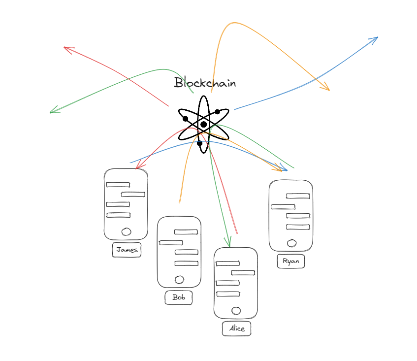
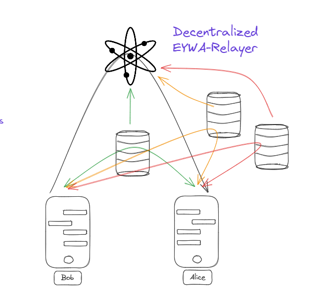

# eywa

# How eywa works

This is a common flow of eywa.

1. User register : User register to eywa chain network with public key.

After user register, user can use eywa service as two way. We assume that alice and bob are registered.

## When use eywa blockchain

Alice want to send message to bob.

1. Alice create handshake : Alice create handshake which contain the bob wallet address
2. Alice Download Bob public key : As same time Alice download Bob public key from eywa chain network.
3. Bob watch handshake : Bob watch handshake which contain the bob wallet address
4. Bob Download Alice public key : When detect handshake, Bob download Alice public key from eywa chain network.
5. Alice create chat message : Alice create chat message which contain the bob wallet address, encrypted message with Bob public key, message time
6. Bob watch chat message : Bob watch chat message which contain the bob wallet address, encrypted message, message time
7. Bob decrypt message : Bob decrypt message with Bob private key
8. Bob create chat message : Bob create chat message which contain the alice wallet address, encrypted message with Alice public key, message time
9. Alice watch chat message : Alice watch chat message which contain the alice wallet address, encrypted message, message time



## When use eywa relayer

Alice want to send message to bob.

1. Alice create handshake : Alice create handshake which contain the bob wallet address, server address, chat room id
2. Alice Download Bob public key : As same time Alice download Bob public key from eywa chain network.
3. Alice Create chat room : Alice create chat room with room id and access socket server.
4. Bob watch handshake : Bob watch handshake which contain the bob wallet address, server address, chat room id
5. Bob Download Alice public key : When detect handshake, Bob download Alice public key from eywa chain network.
6. Bob Access chat room : Bob access chat room with room id and access socket server.
7. Alice create chat message : Alice create chat message to chat room (which use the socket server)
8. Bob create chat message : Bob create chat message to chat room (which use the socket server)

9. Backup the chat message to eywa chain network : The backup of encrypted services is regularly taken from the socket server to the eywa chain.




# API DOCS

## User

### Register User

```bash
  eywad tx eywa register-user [PubKey] --from alice
```

- PubKey : User public key

### Get User By Address

```bash
  eywad q eywa get-user [Address]
```

- Address : USer wallet address

## Handshake

### Create Handshake

```bash
  eywad tx eywa create-handshake [Receiver] [RoomId] [ServerAddress] --from alice
```

- Receiver : Receiver wallet address
- RoomId : Chat Room Id
- ServerAddress : Server Address (ip , domain)

### Get Handshake By Receiver

```bash
  eywad q eywa get-handshake [Receiver]
```

- Receiver : Receiver wallet address

## Relay server

### Create Relay Server

```bash
  eywad tx eywa create-relay-server [Nickname] [Location] --from alice
```

- Nickname : Relay Server nickname
- Location : Relay Server ip (ip , domain)

### Get Relay Server All

```bash
  eywad q eywa get-relay-server-all
```

## Chat Room

### Create Chat Room

```bash
  eywad tx eywa create-chat-room [RoomId] [Receiver] [Message] [Time] --from alice
```

- RoomId : Chat Room Id
- Receiver : Receiver wallet address
- Message : encrypted message
- Time : message time

### Get Chat Room By RoomId

```bash
  eywad q eywa get-chat-room [RoomId]
```

- RoomId : Chat Room Id
